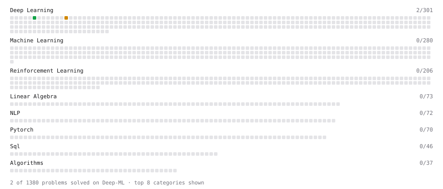

# Deep-ML

My machine learning practice from [Deep-ML](https://www.deep-ml.com). Every solution here was written by hand.

**21** solved · 21 problems · 0 labs · 0 math

[**Browse the interactive portfolio**](https://JingminW.github.io/deep-ml/) to replay this filling in over time.

## Problems

| | Difficulty | Solved | |
| --- | --- | --- | --- |
| [GeLU Activation Function ](https://www.deep-ml.com/problems/147) | easy | 2026-09-25 | [solution](problems/0147-gelu-activation-function) |
| [Implement a Simple Residual Block with Shortcut Connection](https://www.deep-ml.com/problems/113) | easy | 2026-09-21 | [solution](problems/0113-implement-a-simple-residual-block-with-shortcut-connection) |
| [Implement Binary Cross-Entropy Loss](https://www.deep-ml.com/problems/263) | easy | 2026-09-26 | [solution](problems/0263-implement-binary-cross-entropy-loss) |
| [Implement Global Average Pooling](https://www.deep-ml.com/problems/114) | easy | 2026-09-21 | [solution](problems/0114-implement-global-average-pooling) |
| [Implementation of Log Softmax Function](https://www.deep-ml.com/problems/39) | easy | 2026-09-14 | [solution](problems/0039-implementation-of-log-softmax-function) |
| [Momentum Optimizer](https://www.deep-ml.com/problems/146) | easy | 2026-09-23 | [solution](problems/0146-momentum-optimizer) |
| [Adam Optimizer](https://www.deep-ml.com/problems/87) | medium | 2026-09-21 | [solution](problems/0087-adam-optimizer) |
| [Build Scaled Dot-Product Attention](https://www.deep-ml.com/problems/490) | medium | 2026-09-14 | [solution](problems/0490-build-scaled-dot-product-attention) |
| [Implement Adam Optimization Algorithm](https://www.deep-ml.com/problems/49) | medium | 2026-09-17 | [solution](problems/0049-implement-adam-optimization-algorithm) |
| [Implement Batch Normalization for BCHW Input](https://www.deep-ml.com/problems/115) | medium | 2026-09-24 | [solution](problems/0115-implement-batch-normalization-for-bchw-input) |
| [Implement Gated Attention](https://www.deep-ml.com/problems/271) | medium | 2026-09-15 | [solution](problems/0271-implement-gated-attention) |
| [Implement Group Normalization](https://www.deep-ml.com/problems/126) | medium | 2026-09-26 | [solution](problems/0126-implement-group-normalization) |
| [Implement Grouped Query Attention (GQA)](https://www.deep-ml.com/problems/391) | medium | 2026-09-19 | [solution](problems/0391-implement-grouped-query-attention-gqa) |
| [Implement Multiquery Attention (MQA)](https://www.deep-ml.com/problems/390) | medium | 2026-09-17 | [solution](problems/0390-implement-multiquery-attention-mqa) |
| [Implementing a Simple RNN](https://www.deep-ml.com/problems/54) | medium | 2026-09-14 | [solution](problems/0054-implementing-a-simple-rnn) |
| [Instance Normalization (IN) Implementation](https://www.deep-ml.com/problems/143) | medium | 2026-09-26 | [solution](problems/0143-instance-normalization-in-implementation) |
| [Simple Convolutional 2D Layer](https://www.deep-ml.com/problems/41) | medium | 2026-09-21 | [solution](problems/0041-simple-convolutional-2d-layer) |
| [Implement Multi-Head Attention](https://www.deep-ml.com/problems/94) | hard | 2026-09-15 | [solution](problems/0094-implement-multi-head-attention) |
| [Implement Multi-Head Self-Attention](https://www.deep-ml.com/problems/904) | hard | 2026-09-19 | [solution](problems/0904-implement-multi-head-self-attention) |
| [Multi-Head Latent Attention (MLA)](https://www.deep-ml.com/problems/405) | hard | 2026-09-15 | [solution](problems/0405-multi-head-latent-attention-mla) |
| [Positional Encoding Calculator](https://www.deep-ml.com/problems/85) | hard | 2026-09-21 | [solution](problems/0085-positional-encoding-calculator) |

---

_This file is regenerated by Deep-ML on every push._
